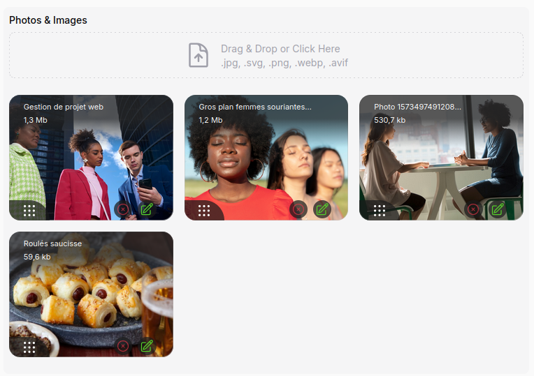

# A Gallery media (Json) for Filament

[](https://packagist.org/packages/webplusm/gallery-json-media)
[](https://github.com/webplusmultimedia/filament-json-media/actions?query=workflow%3Arun-tests+branch%3Amain)
[](https://packagist.org/packages/webplusm/gallery-json-media)


This package add a json field media for images/documents to filament V3.x and fluents api for front-end in Laravel to display photos and url link for documents ...

It is a simple and easy way to manage media in your Laravel application using Filament.

[V3x doc](https://github.com/webplusmultimedia/filament-json-media/tree/3.x) => **Filament V3.x**

## Features
- **Fluent API**: A fluent API for managing media in your Laravel application.
- **Blade Components**: Blade components for displaying media in your Laravel application.
- **Custom Properties**: Custom properties for media, allowing you to add additional informations to your media.

[](https://postimg.cc/wtLMvcK9)

## Requirements

V4.x => **Filament V4.x**  (^PHP 8.2 need)

## Installation

You can install the package via composer:

```bash
composer require webplusm/gallery-json-media
```

## Configuration
Publish the config file with:

```bash
php artisan vendor:publish --tag="gallery-json-media-config"
```
You can change the driver for cropping :

```php
use Spatie\Image\Enums\ImageDriver;
return [
    ...
    'images' => [
        'driver' => ImageDriver::Gd, // or ImageDriver::Imagick
    ],
    ...
]
```

### Remote and private storage
Medias can be stored on any Laravel disk (S3, ...), publicly or privately. Set the defaults in the config :

```php
return [
    'disk' => 's3',
    'visibility' => 'private', // 'public' by default
    ...
]
```

or for a single field :

```php
JsonMediaGallery::make('images')
    ->disk('s3')
    ->visibility('private')
```

- The field values win over the config ones.
- Public files are linked with their direct url, private files with a temporary url. Set its lifetime in minutes with `images.temporary_url_ttl` (5 by default).
- On a remote disk, or for a private file, the thumbnails are generated by a signed route of your application on their first request, then the route redirects to the thumbnail on the disk.
- A private file on a local disk needs the `serve => true` option of the disk, so that Laravel can build its temporary url.
- The medias saved before this version have no recorded visibility : they stay public.

### Translations
You can publish the translations :
```bash
php artisan vendor:publish --tag="gallery-json-media-translations"
```

### CSS configuration
1. You need to [create a theme for your panel](https://filamentphp.com/docs/4.x/styling/overview#creating-a-custom-theme) if you don't have one already,
2. and then add the following to your `theme.css` file:

```css
@import '../../../../vendor/webplusm/gallery-json-media/resources/css/json-media.css';
```


Optionally, you can publish the views using, but please if you don't know what it is, don't do it.

```bash
php artisan vendor:publish --tag="gallery-json-media-views"
```
## Discord

Find it on [discord](https://discord.com/channels/883083792112300104/1220043851977199616)

## Usage
### Prepare your model
```php
use GalleryJsonMedia\JsonMedia\Concerns\InteractWithMedia;
use GalleryJsonMedia\JsonMedia\Contracts\HasMedia;

class Page extends Model implements HasMedia
{
    use HasFactory;
    use InteractWithMedia;
    
    protected $casts =[
        'images' => 'array',
        'documents' => 'array',
    ];
    
    // for auto-delete media thumbnails
    protected function getFieldsToDeleteMedia(): array {
        return ['images','documents'];
    }
    ...
    
}
```

#### Cast to medias
Cast a field with `AsJsonMedia` to read it as a collection of `Media` (images) and `Document` (other files). The json stored in the database does not change, and the Filament field and the `InteractWithMedia` methods keep working.
```php
use GalleryJsonMedia\JsonMedia\Casts\AsJsonMedia;

protected $casts = [
    'images' => AsJsonMedia::class,
    'documents' => AsJsonMedia::class,
];
```
```php
$page->images; // Collection<Media|Document>
$page->images->first()->getCropUrl(400, 300);
```
The medias are read-only: to change a field, assign it new entries (arrays, `Media` or `Document`).

### In Filament Forms
```php
use GalleryJsonMedia\Form\JsonMediaGallery;
JsonMediaGallery::make('images')
    ->directory('page')
    ->reorderable() 
    ->acceptedFileTypes()
    ->disk('s3') // any Laravel disk, the `gallery-json-media.disk` config by default
    ->visibility('private') // 'public' or 'private', see "Remote and private storage"
    ->maxSize(4 * 1024)
    ->minSize()
    ->maxFiles(2)
    ->minFiles(1)
    ->replaceTitleByAlt() // If you want to show alt customProperties  against file name
    ->image() // only images by default , u need to choose one method (image or document)
    ->document() // only documents (eg: pdf, doc, xls,...)
    ->downloadable()
    ->deletable()
    ->withCustomProperties(
       customPropertiesSchema: [                                     
            ...some form fields here
        ],
       editCustomPropertiesOnSlideOver: true,
       editCustomPropertiesTitle: "Edit customs properties"
    )
    ->editableCustomProperties(bool|Closure) // if you want to enable/disable the custom properties edition ;
```
### Show your media in a grid way

You can now view your medias in **grid** list like this :

```php
use GalleryJsonMedia\Tables\Columns\JsonMediaColumn;
JsonMediaGallery::make('images')
    ...
    ->displayOnGrid()
```

### In Filament Tables

```php
use GalleryJsonMedia\Tables\Columns\JsonMediaColumn;
JsonMediaColumn::make('images')
    ->avatars(bool|Closure)
```
### In Filament Infolists
```php
use GalleryJsonMedia\Infolists\JsonMediaEntry;
use GalleryJsonMedia\Infolists\JsonDocumentsEntry;
JsonMediaEntry::make('images')
    ->avatars()
    ->thumbHeight(100)
    ->thumbWidth(100)
    ->visible(static fn(array|null $state)=> filled($state))


// or for Documents, you can download them here 
GalleryJsonMedia\Infolists\JsonDocumentsEntry::make('documents')
    ->columns(4)
    ->columnSpanFull()
```

### In Blade Front-end
The `image` component renders a lazy `` with the thumbnail of the requested size and the `alt` of the media. Without a size, it shows the original image. Your attributes are added to the tag and replace the defaults (`alt`, `loading`).
```html
@foreach($page->images as $media)
    <x-gallery-json-media::image :media="$media" :width="400" :height="300" class="rounded" />
@endforeach
```
The `format` attribute converts the thumbnail (`format="webp"`). Without `<picture>`, there is no fallback for a browser that cannot read the format: keep it for `webp`, which every current browser reads.

#### Responsive images
The `responsive-image` component takes the same attributes and lets the browser choose the thumbnail it needs:
- the `srcset` offers the thumbnails of the same ratio in the widths of the `images.responsive.widths` config, up to twice the displayed width for the high density screens;
- the default `sizes` is `(max-width: 1200px) 100vw, 1200px`, give your own `sizes` attribute for your layout;
- a `<picture>` offers the thumbnails converted to the `images.responsive.formats` config (`webp` by default), or to the `formats` of the component, by order of preference.

```html
<x-gallery-json-media::responsive-image :media="$media" :width="1200" :height="600" sizes="(min-width: 1024px) 50vw, 100vw" />
```
Each thumbnail is generated only when a browser requests it, so a format or a width that no visitor needs is never created. A converted thumbnail keeps the extension of its image: `photo-400x300.jpg.webp`. AVIF (`:formats="['avif', 'webp']"`) needs an image driver (GD or Imagick) built with AVIF support. Without a width, or for a svg, the component renders a single image like `image`.

Or with the `InteractWithMedia` methods :
```html
<!-- for media -->
@foreach($page->getMedias('images') as $media)
    <div style="display: flex;gap: .5rem">
        {{ $media }}
    </div>
@endforeach
 
<!-- For documents -->
<div>
    <ul>
        @foreach($page->getDocuments('documents') as $document)
            <li>
                <a href="{{ $document->getUrl() }}" target="_blank">
                    {{ $document->getCustomProperty('title') }}
                </a>
            </li>
        @endforeach
    </ul>
</div>
```
You can also control the entire view to render the media by passing a blade file to your view like this :
```html
@foreach($page->getMedias('images') as $media)
    <div style="display: flex;gap: .5rem">
        {{ $media->withImageProperties( width : 200,height: 180)->withView('page.json-media') }}
    </div>
 @endforeach


<!-- the json-media.blade.php -->
@php
   use GalleryJsonMedia\JsonMedia\Media;
   /** @var Media $media*/
   $media
@endphp
<figure class="" style="width: {{ $media->width }}px">
    getCropUrl(width: $media->width,height: $media->height) }}"
         alt="{{ $media->getCustomProperty('alt') }}"
         width="{{ $media->width }}"
         height="{{ $media->height }}"
    >
</figure>
```

### Maintenance
Both commands work on the disk of the package config, give other disks with `--disk=s3 --disk=public`. They never touch a file outside the `root_directory`.

**Clean the orphan files**
```bash
php artisan gallery-json-media:clean --dry-run   # list the files to delete
php artisan gallery-json-media:clean             # delete them, after confirmation
php artisan gallery-json-media:clean --force     # without confirmation (cron, deployment)
```
It deletes the thumbnails whose image is missing. To also delete the files that no record uses, with their thumbnails, declare the json media fields of your models:
```php
// config/gallery-json-media.php
'maintenance' => [
    'models' => [
        App\Models\Post::class => ['images', 'documents'],
    ],
],
```
Declare all of them: every other file of the `root_directory` is deleted, so the files of a forgotten field would be too. The soft deleted records keep their files.

**Render the thumbnails again**
```bash
php artisan gallery-json-media:regenerate
```
It renders every existing thumbnail again from its image, with the same size and format: run it after a change of `quality` or of `driver`. The thumbnails are generated when a browser requests them, so the command only renders the ones that already exist.


## Testing

```bash
composer test
```

## Changelog

Please see [CHANGELOG](CHANGELOG.md) for more information on what has changed recently.

## Contributing

Please see [CONTRIBUTING](.github/CONTRIBUTING.md) for details.

## Security Vulnerabilities

Please review [our security policy](https://github.com/webplusmultimedia/filament-json-media/security/policy) on how to report security vulnerabilities.

## Credits

- [webplusm](https://github.com/webplusmultimedia)

## License

The MIT License (MIT). Please see [License File](LICENSE.md) for more information.
